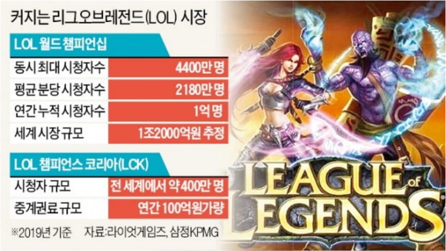

<!--  -->

# 리그오브레전드 전적검색 및 AI 서비스 웹 플랫폼 - strategy.gg
### 목차
[1. 팀 소개 및 역할](#1.-팀-소개-및-역할) 
[2. 프로젝트 동기 및 소개](#2.-프로젝트-동기-및-소개) 
[    2-1. 동기](#2-1.-동기) 
[    2-2. 소개](#2-2.-소개) 
[3. 데이터 수집](#3.-데이터-수집) 

---

## 1. 팀 소개 및 역할
- 이상현: BE, AI engineer
- 유시현: FE engineer
- 노태형: AI engineer
- 유미리: FE engineer 

## 2. 프로젝트 동기 및 소개
### 2-1. 동기
알파테스트, 그리고 베타테스트를 마치고 2010년 7월 정식으로 리그오브레전드(League of Legends, LOL)가 출시되었다. 레드팀과 블루팀으로 나누어 최종적으로 상대방의 넥서스(건물)를 부수는 것을 목표로 하는 AOS(게임 업계 용어로는 MOBA)장르인 롤은 10년이 흐른 지금 많은 경쟁자들의 등장과 여러 번의 위기가 있었음에도 최고 동시접속자 800만명1과 롤드컵 2019 순간 최고시청자 수 4400만명을 달성하며 전세계적으로 선풍적인 인기를 끌고 있다. 이런 선풍적인 인기를 바탕으로 2018년 아시안게임 시범종목으로 발탁되기도 하였다.

[그림 1] 리그오브레전드의 인기 및 시장성
